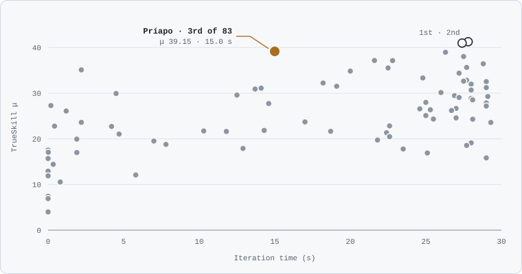
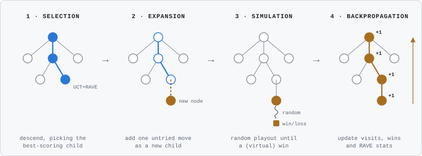
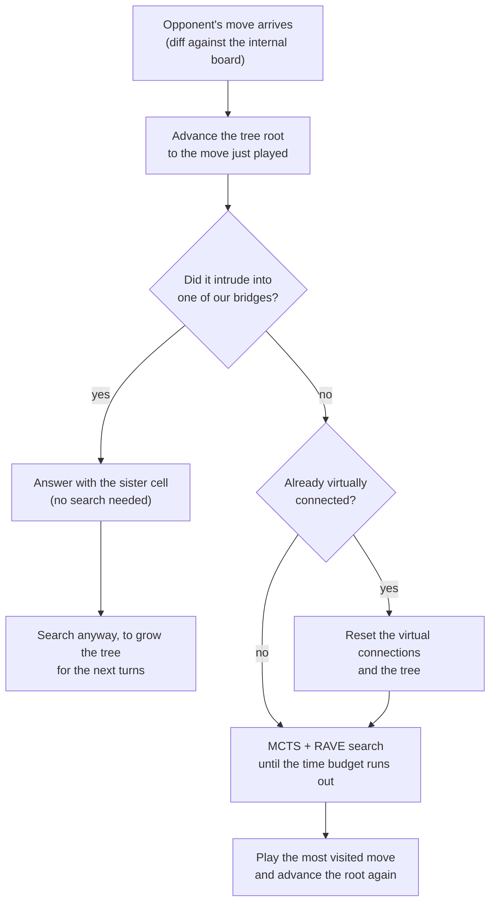

<div align="center">

# ⬡ hexbot_priapo

**A Hex-playing agent built on Monte Carlo Tree Search, written in pure Python.**

It combines MCTS with RAVE, virtual connections (bridges) and search-tree reuse, all tuned to play
well under a fixed time budget per move and a 500 MB memory cap. It finished **🥉 3rd out of 83 agents**
in a university tournament, using about half the thinking time of the two agents above it.


[Results](#-tournament-results) ·
[Features](#-features) ·
[Quick start](#-quick-start) ·
[How MCTS works](#-how-mcts-works) ·
[Beyond plain MCTS](#-beyond-plain-mcts) ·
[Trade-offs](#-design-trade-offs) ·
[Testing](#-testing)

</div>

---

> [!NOTE]
> **Academic origin.** The agent was first written for the **Fundamentos de la Inteligencia Artificial** course at
> **Universidad de San Andrés** (UdeSA), Argentina. Student agents played each other on 13×13 boards and were ranked
> with TrueSkill, with a fixed time budget per move and a 500 MB memory cap. Those constraints shaped most of the
> design decisions below. The coursework was later refined into a standalone package with a library API, a CLI and a test suite.

---

## 🏆 Tournament results

Competing as **Príapo**, the agent finished **3rd out of 83** in the final TrueSkill standings, with
**0% errors** and **0% timeouts**. Its iteration time was **15.0 s**, against 27–28 s for the two agents that finished above it.

<p align="center">
  
</p>
<p align="center"><sub>
  Each dot is one ranked agent: higher means stronger, further right means slower.
  Most of the top ten use more than 25 s; Príapo reaches the podium with about half of that.
</sub></p>

| # | Agent | Rating (μ ± σ) | Iteration time | Errors | Timeouts |
|--:|:--|:--|--:|--:|--:|
| 🥇 1 | PerretAgent | 41.27 ± 1.32 | 27.8 s | 0.00% | 0.00% |
| 🥈 2 | AgenteCassanello | 40.96 ± 1.31 | 27.4 s | 0.00% | 4.76% |
| **🥉 3** | **Príapo** | **39.15 ± 1.27** | **15.0 s** | **0.00%** | **0.00%** |
| 4 | Hexconvicto | 38.95 ± 1.29 | 26.3 s | 0.00% | 0.00% |
| 5 | Rami Colapinto🏎️ v2.0 | 38.03 ± 1.28 | 27.5 s | 0.00% | 0.00% |
| 6 | etnL | 37.16 ± 1.29 | 21.6 s | 0.00% | 2.38% |
| 7 | 🤖SmartAgent | 37.13 ± 1.30 | 22.8 s | 0.00% | 0.00% |
| 8 | hombre aguja | 36.44 ± 1.30 | 28.8 s | 0.00% | 0.00% |
| 9 | Sheconquista | 35.64 ± 1.30 | 27.7 s | 0.00% | 0.00% |
| 10 | KirAgent | 35.52 ± 1.31 | 22.5 s | 0.00% | 0.00% |

<details>
<summary><b>Full standings (83 agents)</b></summary>

| # | Agent | Rating (μ ± σ) | Iteration time | Errors | Timeouts |
|--:|:--|:--|--:|--:|--:|
| 🥇 1 | PerretAgent | 41.27 ± 1.32 | 27.8 s | 0.00% | 0.00% |
| 🥈 2 | AgenteCassanello | 40.96 ± 1.31 | 27.4 s | 0.00% | 4.76% |
| **🥉 3** | **Príapo** | **39.15 ± 1.27** | **15.0 s** | **0.00%** | **0.00%** |
| 4 | Hexconvicto | 38.95 ± 1.29 | 26.3 s | 0.00% | 0.00% |
| 5 | Rami Colapinto🏎️ v2.0 | 38.03 ± 1.28 | 27.5 s | 0.00% | 0.00% |
| 6 | etnL | 37.16 ± 1.29 | 21.6 s | 0.00% | 2.38% |
| 7 | 🤖SmartAgent | 37.13 ± 1.30 | 22.8 s | 0.00% | 0.00% |
| 8 | hombre aguja | 36.44 ± 1.30 | 28.8 s | 0.00% | 0.00% |
| 9 | Sheconquista | 35.64 ± 1.30 | 27.7 s | 0.00% | 0.00% |
| 10 | KirAgent | 35.52 ± 1.31 | 22.5 s | 0.00% | 0.00% |
| 11 | LeAgent 🐐 | 35.10 ± 1.27 | 2.2 s | 2.38% | 0.00% |
| 12 | Yabot | 34.83 ± 1.29 | 20.0 s | 0.00% | 0.00% |
| 13 | Hextech Agent 2.0 | 34.38 ± 1.29 | 27.2 s | 0.00% | 0.00% |
| 14 | Wall-E🤖 | 33.33 ± 1.27 | 24.8 s | 0.00% | 0.00% |
| 15 | Turko 👽 | 32.84 ± 1.29 | 27.7 s | 0.00% | 0.00% |
| 16 | 🪸Maestro Alga🪸 | 32.62 ± 1.28 | 27.5 s | 0.00% | 0.00% |
| 17 | Jaz | 32.54 ± 1.27 | 29.0 s | 0.00% | 0.00% |
| 18 | 🐜 lacayo de Fede Pizarro 🐜 | 32.22 ± 1.29 | 18.2 s | 0.00% | 0.00% |
| 19 | 🕹️ DoorAgent | 31.98 ± 1.28 | 28.0 s | 0.00% | 0.00% |
| 20 | 🤖 Paranoid Android | 31.51 ± 1.29 | 19.1 s | 0.00% | 0.00% |
| 21 | 007Agent | 31.21 ± 1.29 | 29.0 s | 0.00% | 0.00% |
| 22 | 🪲Hex Jude (Remaster) | 31.10 ± 1.28 | 14.1 s | 0.00% | 0.00% |
| 23 | Caminito | 30.90 ± 1.28 | 13.7 s | 0.00% | 0.00% |
| 24 | El DiDi pistero de Gian | 30.68 ± 1.28 | 28.0 s | 0.00% | 0.00% |
| 25 | Clanker | 30.13 ± 1.28 | 26.0 s | 0.00% | 0.00% |
| 26 | 🐙Jugador 456 | 29.92 ± 1.28 | 4.5 s | 0.00% | 0.00% |
| 27 | Kowalski | 29.58 ± 1.27 | 12.5 s | 0.00% | 0.00% |
| 28 | R2-D2 🚀 | 29.46 ± 1.30 | 26.9 s | 0.00% | 0.00% |
| 29 | Teenager | 29.27 ± 1.29 | 29.1 s | 0.00% | 0.00% |
| 30 | 🦦 Agente P v3 | 29.05 ± 1.26 | 27.2 s | 0.00% | 9.52% |
| 31 | CardelliAgent | 28.84 ± 1.29 | 28.0 s | 0.00% | 0.00% |
| 32 | ClickAgent 2.0 | 28.53 ± 1.27 | 28.1 s | 0.00% | 0.00% |
| 33 | Piñatomico | 27.97 ± 1.28 | 25.0 s | 0.00% | 0.00% |
| 34 | Terminator | 27.98 ± 1.29 | 29.0 s | 0.00% | 0.00% |
| 35 | MyAgent | 27.86 ± 1.28 | 29.0 s | 0.00% | 0.00% |
| 36 | CasasAgent | 27.73 ± 1.28 | 14.6 s | 0.00% | 0.00% |
| 37 | agentBeta | 27.28 ± 1.27 | 187.45 ms | 0.00% | 0.00% |
| 38 | Ginés | 27.18 ± 1.28 | 29.0 s | 0.00% | 0.00% |
| – | ZuberbuhlerAgent | 26.71 ± 2.43 | 19.5 s | 0.00% | 0.00% |
| 39 | Botti 👹👹👹 | 26.66 ± 1.29 | 27.0 s | 0.00% | 0.00% |
| 40 | O⬡ hexGoat ⬡O | 26.56 ± 1.29 | 24.6 s | 0.00% | 0.00% |
| 41 | Pardoval | 26.37 ± 1.29 | 25.3 s | 0.00% | 2.38% |
| 42 | AlphaMathiK | 26.21 ± 1.29 | 26.7 s | 0.00% | 0.00% |
| 43 | Alejandrito | 26.09 ± 1.29 | 1.2 s | 0.00% | 0.00% |
| 44 | Andex__agent | 25.09 ± 1.29 | 25.0 s | 0.00% | 0.00% |
| 45 | AlphaHex | 24.59 ± 1.31 | 27.0 s | 0.00% | 0.00% |
| 46 | Inés | 24.33 ± 1.28 | 25.5 s | 0.00% | 14.29% |
| 47 | persi | 24.30 ± 1.30 | 28.1 s | 0.00% | 0.00% |
| 48 | 😊Hexterminator | 23.70 ± 1.28 | 17.0 s | 0.00% | 0.00% |
| 49 | anALPHABETO | 23.61 ± 1.29 | 2.2 s | 0.00% | 0.00% |
| 50 | Curacautin3.3.3 36346 | 23.58 ± 1.29 | 29.3 s | 0.00% | 0.00% |
| 51 | 🐸FC43 | 22.83 ± 1.29 | 22.6 s | 0.00% | 0.00% |
| 52 | Pepito | 22.78 ± 1.30 | 427.14 ms | 0.00% | 0.00% |
| 53 | HexaShus | 22.71 ± 1.28 | 4.2 s | 0.00% | 0.00% |
| 54 | 🎭CastañosZemborain | 21.84 ± 1.30 | 14.3 s | 0.00% | 0.00% |
| 55 | 🐻AgenteOsoRAVE | 21.72 ± 1.29 | 10.3 s | 0.00% | 0.00% |
| 56 | ❤️ Agente Martu | 21.65 ± 1.30 | 18.7 s | 0.00% | 0.00% |
| 57 | 🏎️BoxBox | 21.62 ± 1.29 | 11.8 s | 0.00% | 0.00% |
| 58 | Patruno_Agent | 21.35 ± 1.28 | 22.4 s | 0.00% | 0.00% |
| 59 | 🎀Dai | 21.04 ± 1.30 | 4.7 s | 0.00% | 0.00% |
| – | The Goat🐐 | 21.04 ± 4.17 | 11.8 s | 0.00% | 0.00% |
| 60 | Everdeen | 20.48 ± 1.30 | 22.6 s | 0.00% | 0.00% |
| 61 | 💐juaa76cool 36803 | 19.94 ± 1.30 | 1.9 s | 0.00% | 0.00% |
| 62 | ✨Hexpecto Patronum | 19.74 ± 1.29 | 21.8 s | 0.00% | 0.00% |
| 63 | Lucía Agent | 19.52 ± 1.30 | 7.0 s | 0.00% | 0.00% |
| 64 | SaloGrande 34610 | 19.11 ± 1.28 | 28.0 s | 0.00% | 0.00% |
| 65 | 🧠 AlphaGoat | 18.78 ± 1.30 | 7.8 s | 0.00% | 0.00% |
| 66 | Larigod | 18.56 ± 1.30 | 27.7 s | 0.00% | 0.00% |
| 67 | 🍕 Piza | 17.89 ± 1.27 | 12.9 s | 0.00% | 0.00% |
| 68 | bIAnca | 17.77 ± 1.29 | 23.5 s | 0.00% | 0.00% |
| 69 | 🥥Half | 17.54 ± 1.28 | 0.03 ms | 0.00% | 0.00% |
| 70 | 🤖SmartAgent1 | 17.06 ± 1.30 | 15.11 ms | 0.00% | 0.00% |
| 71 | 🦋El Viaje de CHIHIRO ガイア | 17.00 ± 1.34 | 1.9 s | 0.00% | 0.00% |
| 72 | Faker | 16.91 ± 1.31 | 25.1 s | 0.00% | 0.00% |
| – | Greek Agent | 16.37 ± 2.46 | 28.2 s | 0.00% | 0.00% |
| 73 | Montecarleano | 15.83 ± 1.30 | 29.0 s | 0.00% | 0.00% |
| 74 | 🥇First | 15.69 ± 1.32 | 0.08 ms | 0.00% | 0.00% |
| 75 | AgenteCheckpoint | 14.41 ± 1.12 | 340.30 ms | 0.00% | 0.00% |
| 76 | 🧙💍🧒⛰️u shall not pass🧝🏰🌋 | 12.98 ± 1.31 | 1.46 ms | 0.00% | 0.00% |
| 77 | 🥽Antifaz | 12.91 ± 1.29 | 0.50 ms | 0.00% | 0.00% |
| 78 | 🎲LuckyAgent 35720 | 12.09 ± 1.10 | 5.8 s | 0.00% | 0.00% |
| 79 | 🎭Adjacent | 11.90 ± 1.29 | 0.29 ms | 0.00% | 0.00% |
| 80 | Foiler | 10.55 ± 1.36 | 804.84 ms | 0.00% | 0.00% |
| 81 | 🎯Center | 7.43 ± 1.35 | 0.17 ms | 0.00% | 0.00% |
| 82 | ❌ | 6.92 ± 1.46 | 0.03 ms | 0.00% | 0.00% |
| 83 | 🎲Randall_M 2982 | 3.99 ± 1.58 | 0.08 ms | 0.00% | 0.00% |

</details>

---

## ✨ Features

| | |
|---|---|
| 🌳 **MCTS + RAVE** | Time-bounded Monte Carlo Tree Search. Node selection blends UCT with all-moves-as-first statistics (the MoHex formula), so good moves stand out after few simulations. |
| 🌉 **Virtual connections** | Detects *bridges*, the basic unbreakable two-cell template of Hex, and ends rollouts as soon as a player is virtually connected. |
| 🛡️ **Instant bridge defense** | When the opponent intrudes into one of the agent's bridges, it answers with the sister cell without searching, then uses the turn's time to grow the tree anyway. |
| ♻️ **Tree reuse** | The search tree survives between turns: the root follows the moves actually played, so earlier work keeps paying off. |
| ⚡ **Fast win detection** | A Union-Find structure answers "has this player won?" with two `find` calls, which matters because every rollout asks after every stone. |
| 🪶 **Small memory footprint** | Compact `array` buffers instead of Python lists cut memory use by about an order of magnitude and keep the agent under the 500 MB cap. |
| 🐍 **Pure Python** | NumPy is the only dependency. Use it from the CLI or import it as a library. |

---

## 🚀 Quick start

### Install

```bash
git clone https://github.com/BarralMaximo/hexbot_priapo.git
cd hexbot_priapo
pip install -e .          # or: pip install -e ".[dev]" to run the tests
```

Requires Python 3.11 or later.

### Play from the terminal

```text
usage: play.py [--size N] [--time SECONDS] [--opponent {random,human,self}] [--agent-second]

  --size          board side (default 9)
  --time          agent seconds per move (default 2.0)
  --opponent      who plays against the agent (default random)
  --agent-second  let the opponent move first
```

```bash
python examples/play.py --opponent random --size 9 --time 2   # watch it beat a random player
python examples/play.py --opponent human  --size 7 --time 3   # play against it
python examples/play.py --opponent self   --size 9 --time 1   # let it play itself
```

The board is printed after every move. `X` connects left and right, `O` connects top and bottom,
and each row is shifted to suggest the hexagonal grid. As a human player you enter moves as `row col`.

### Use it as a library

```python
import numpy as np
from hex_mcts import MCTSAgent, RandomAgent, play_match

agent = MCTSAgent(board_size=9, time_limit=2.0)
winner = play_match(agent, RandomAgent(), size=9, verbose=True)

# Lower-level: ask for a move on any position (the agent is +1 and connects left-right)
board = np.zeros((9, 9), dtype=int)
move = agent.action(board)          # flat index: row * 9 + col
```

The agent always sees itself as player `+1`, connecting the **left and right** edges. When it plays second,
`play_match` hands it a transposed, sign-flipped board. This convention comes from the tournament harness.

---

## 🌳 How MCTS works

A 13×13 Hex board has 169 cells and games run for dozens of moves, so exploring every line of play, as minimax does, is
out of the question. Writing a good evaluation function for Hex positions by hand is also hard.
**Monte Carlo Tree Search** avoids both problems. Instead of judging positions, it **plays many quick random games**
from the current one and keeps statistics on which moves led to wins. Moves that look promising get explored more, so the
effort goes where it matters.

The search builds a tree rooted at the current position. Each node is a position reached by one move, and it stores how many
simulations passed through it (*visits*) and how many of those were won (*wins*). Each iteration of the search has four phases:

<p align="center">
  
</p>

1. **Selection.** Start at the root and walk down the tree. At each node, pick the child with the best score, which balances
   *exploitation* (children that win often) against *exploration* (children tried only a few times, whose estimate is still unreliable).
2. **Expansion.** When the walk reaches a node with moves not yet in the tree, add one of them as a new child.
3. **Simulation.** From the new node, play random moves until the game ends. Hex has no draws, so every simulation (also called a *rollout*) has a winner.
4. **Backpropagation.** Walk back up to the root. Every node on the path gets one more visit, and one more win if its player won the rollout.

The loop repeats until the time budget runs out, and then the agent plays the root's **most visited** move. The visit count
is a more reliable signal than the win rate, because selection only keeps returning to a move while it keeps looking good.

One random game says almost nothing about a position, but thousands of them do. The win rates converge toward the real
strength of each move, and the tree grows deepest along the lines that matter.

The classic selection score is **UCT** (Upper Confidence bounds applied to Trees):

```text
UCT = Q + c · √(ln N / n)

  Q   win rate of the child             n   visits of the child
  N   visits of the parent              c   exploration constant (0.2 here)
```

The first term rewards moves that have won so far. The second shrinks as a child gets visited, so a move that has been tried
only a few times keeps getting a chance.

---

## 🧠 Beyond plain MCTS

Plain MCTS plays reasonable Hex, but on a 13×13 board with a fixed time per move it learns too slowly. Each addition below makes
the time budget go further. This is what happens on every turn:



### 1. RAVE: learning from every move of a rollout

A rollout plays dozens of moves, but plain MCTS only learns about the one move that leads to the new node.
**RAVE** (Rapid Action Value Estimation) also credits every other move the same player made during the rollout, assuming that a
move that helped win later in the game would probably help if played now (*all moves as first*, or AMAF). That estimate is biased,
but it is available after very few simulations. Selection blends the two:

```text
score = (1 − w) · (Q + c·√(ln N / n))  +  w · Q_RAVE        w = n_RAVE / (n_RAVE + n)
```

While a child has few real visits, `w` is close to 1 and the fast RAVE estimate drives the search. As real visits pile up, `w`
shrinks and the exact UCT estimate takes over. RAVE counters start with small pseudo-counts (8 visits, 4 wins, values from the
MoHex paper) so the first few rollouts don't swing the estimates too much.

### 2. Bridges: virtual connections

A **bridge** is the most basic connection template in Hex: two stones that are not adjacent but share two empty neighbors.
If the opponent takes one of those cells, the owner takes the other, so the two stones cannot be cut apart.

```text
   X   a            X     the agent's stones
     b   X          a, b  the two shared empty cells (critical cells)

   O plays a   →   the agent plays b   →   both X stones stay connected
```

The agent uses bridges in two ways:

- **Shorter rollouts.** A second, *virtual* Union-Find also joins bridged stones. A rollout stops as soon as one player is
  virtually connected from edge to edge, because the rest of that game is a formality. Shorter rollouts mean more of them
  in the same time, and a stronger search.
- **Instant defense.** The agent remembers the bridges it builds on the real board. If the opponent plays into a critical
  cell, the agent answers with the other one immediately. The turn's time budget is not wasted: the agent still runs the
  search, only to grow the tree for the following turns.

### 3. Tree reuse

After every move, played by either side, the root of the tree moves down to the matching child, and the rest of the tree is
dropped. The statistics gathered for that subtree on earlier turns stay valid, so the agent often starts a turn with a large tree
already built. The forced bridge replies feed this too, because their search time goes entirely into the tree.

### 4. Union-Find win detection

Every stone is joined to its same-colored neighbors, and stones on an edge are also joined to a virtual node for that edge.
Checking "has this player won?" then comes down to asking whether the two edge nodes are in the same set: two `find` calls
instead of a graph traversal. Rollouts check for a win after every stone, thousands of times per move, so this is the most
performance-critical structure in the project.

The Union-Find is also built for memory. Parent and rank tables live in compact `array('H')` and `array('B')` buffers instead of
Python lists. That cut the agent's memory use by about an order of magnitude: early versions that used lists went over the
tournament's 500 MB cap.

---

## 🧩 Design trade-offs

These shortcuts are deliberate. Each one trades a rare loss in accuracy for speed or memory.

| Shortcut | Why it is acceptable |
|---|---|
| **Overlapping bridges are discarded** (the first one detected wins) | Handling overlaps exactly would mean rebuilding the virtual Union-Find on every collision. The occasional sub-optimal forced reply is cheaper. |
| **Virtual unions are never undone** | A rollout can end on a "virtual win" whose critical cells were filled later in that same rollout. This is a standard approximation: the player could have answered each intrusion when it happened. |
| **Virtual connections reset once the agent is connected** | From then on every rollout would end in an instant win and the search could no longer tell moves apart. Resetting forces MCTS to find the concrete winning sequence. |
| **2-byte RAVE counters** (`array('H')`) | They keep per-node memory small. Within realistic time budgets they never reach their limit, and backpropagation clamps them just in case. |

---

## 🧪 Testing

```bash
pip install -e ".[dev]"
pytest              # 22 tests, about 2 seconds
```

| File | What it covers |
|---|---|
| [`test_union_find.py`](tests/test_union_find.py) | Disjoint sets, transitivity, compact array types, independent copies |
| [`test_board.py`](tests/test_board.py) | Move placement and turns, wins for both players, diagonal connections, incomplete chains |
| [`test_bridges.py`](tests/test_bridges.py) | Bridge detection, sister-cell responses, bookkeeping after intrusions, virtual wins |
| [`test_mcts.py`](tests/test_mcts.py) | Legal moves, finding an immediate win, forced bridge defense, beating a random player |

---

## 📁 Project layout

```text
hexbot_priapo/
├── hex_mcts/
│   ├── agent.py        # MCTSAgent: turn orchestration, bridge defense, tree reuse
│   ├── mcts.py         # MCTS engine and tree nodes with RAVE statistics
│   ├── board.py        # board rules, Union-Find win detection, bridge templates
│   ├── union_find.py   # memory-compact DSU (union by rank + path compression)
│   └── match.py        # standalone match runner and ASCII rendering
├── examples/
│   └── play.py         # CLI: agent vs. random / human / itself
├── tests/              # pytest suite
├── docs/               # README figures
└── pyproject.toml
```

---

## 📖 References

- Cameron Browne et al., *A Survey of Monte Carlo Tree Search Methods*. IEEE Transactions on Computational Intelligence and AI in Games, 2012.
  A broad introduction to MCTS and its variants.
- Levente Kocsis and Csaba Szepesvári, *Bandit Based Monte-Carlo Planning*. ECML, 2006.
  The paper that introduced UCT.
- Broderick Arneson, Ryan Hayward and Philip Henderson, *Monte Carlo Tree Search in Hex*. IEEE Transactions on Computational Intelligence and AI in Games, 2010.
  MoHex, its RAVE weighting and prior values.
- Sylvain Gelly and David Silver, *Monte-Carlo Tree Search and Rapid Action Value Estimation in Computer Go*. Artificial Intelligence, 2011.
  RAVE and AMAF.
